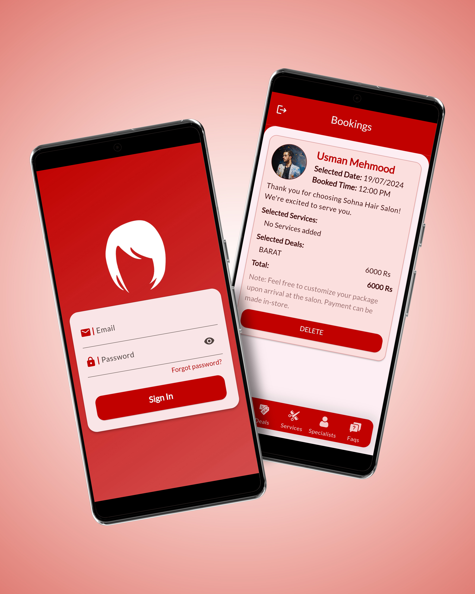
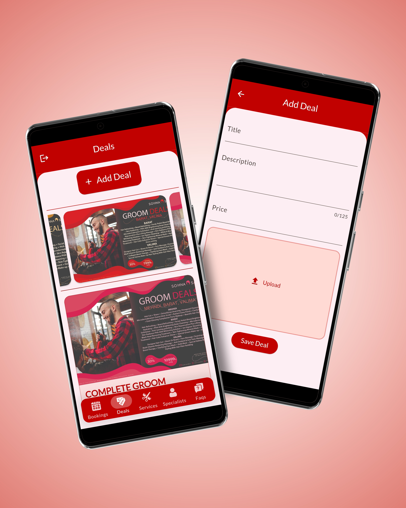
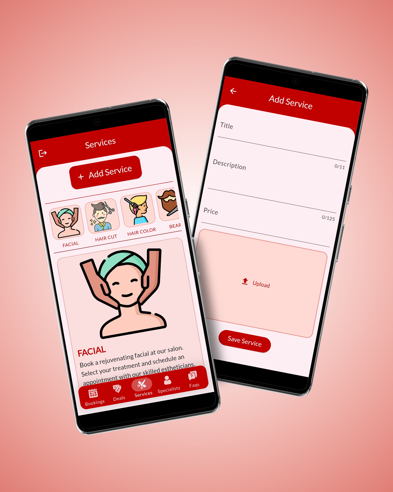
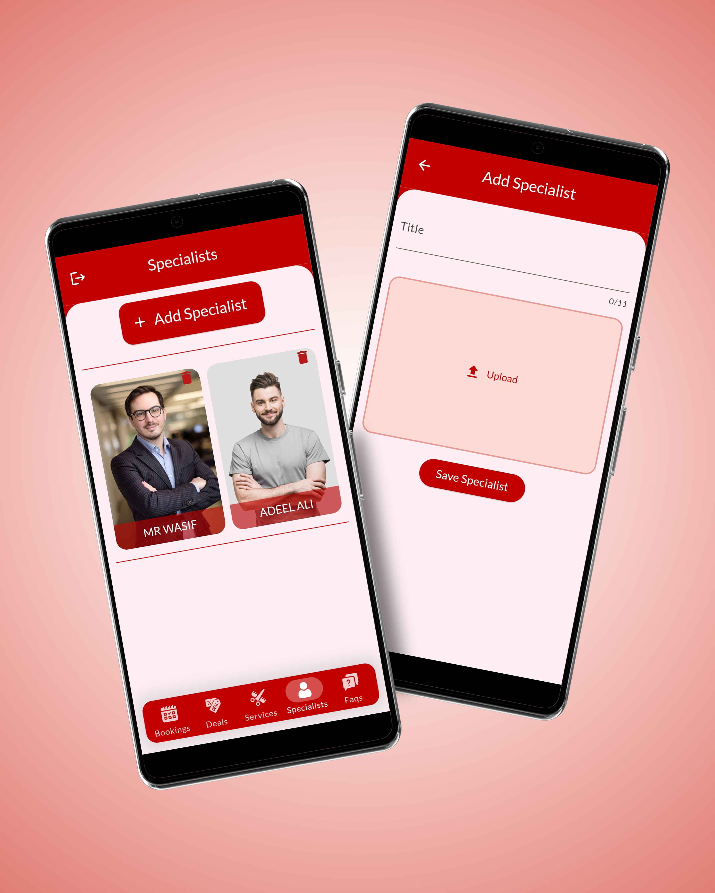
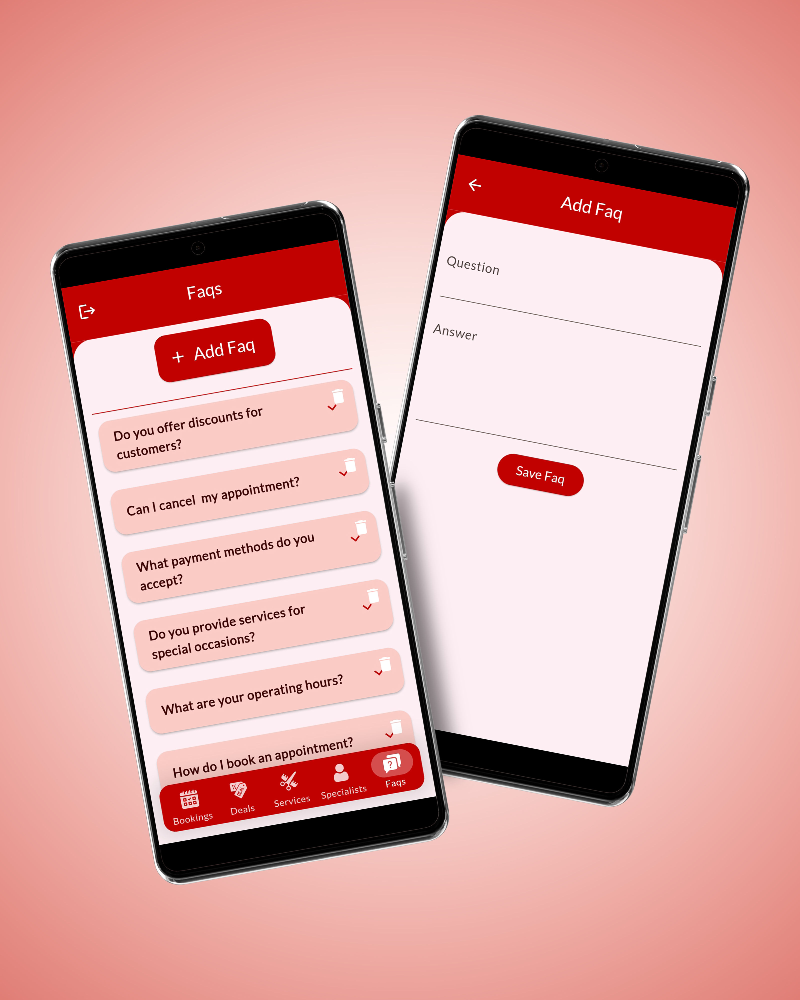

# Admin Salon App

## My Screens:
  
  

  
  
  
  
  
  

## Authentication: 
  User login via an email/password specific for admin only

## Bookings Management Screen: 
  Display and manage bookings made by users.

## Deals Management Screen: 
  View, add and remove deals that contains images,title and a descriptions. This changes will reflect on Sohna Salon App. 

## Services Management Screen:
   View, add and remove services that contains images,title and a descriptions. This changes will reflect on Sohna Salon App.

## Specialist Management Screen: 
  View, add and remove specialist that contains images,title and a descriptions. This changes will reflect on Sohna Salon App.

## FAQs Management Screen: 
  Display and manage faqs. This changes will reflect on Sohna Salon App.

## Backend: 
  Data stored and fetched using Firebase; Stream Provider and RiverPod for data management.